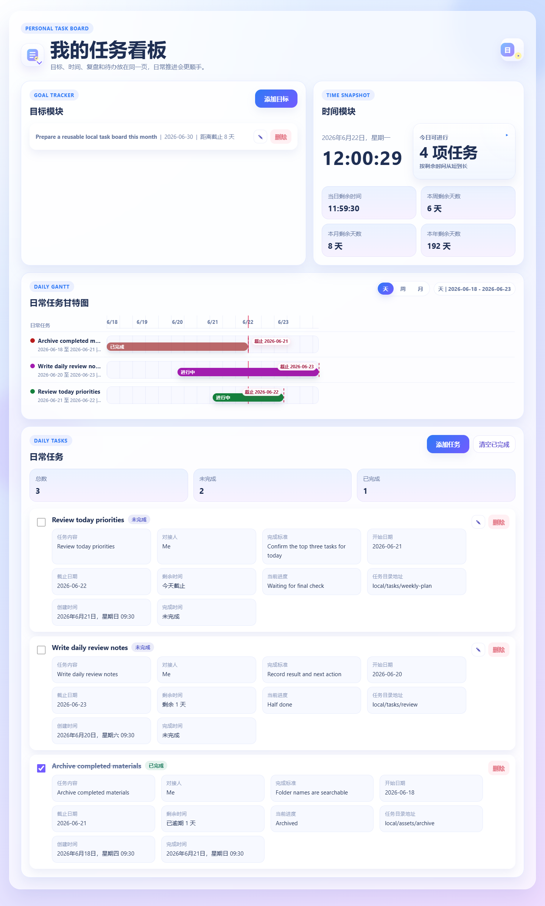
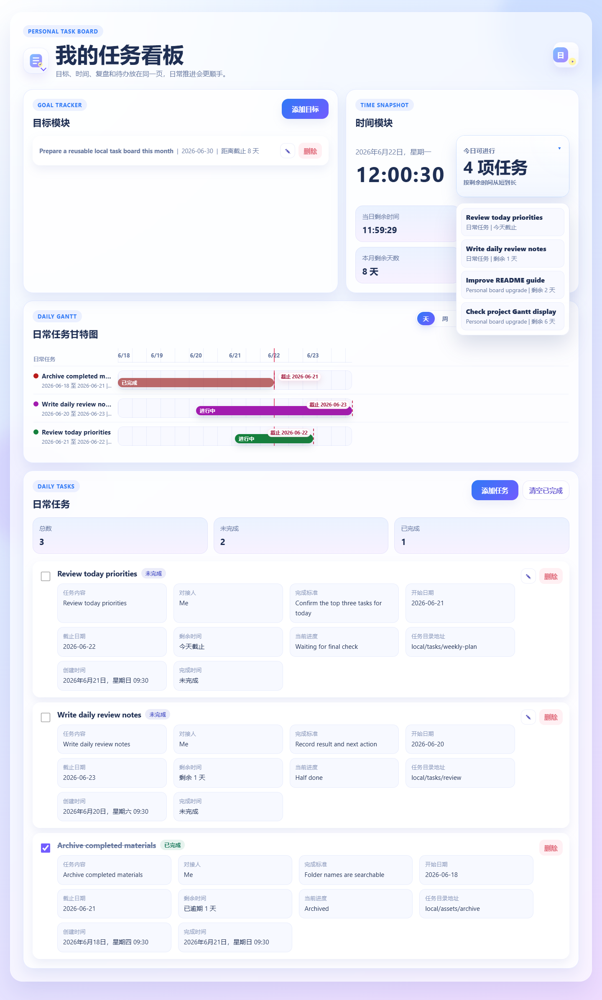
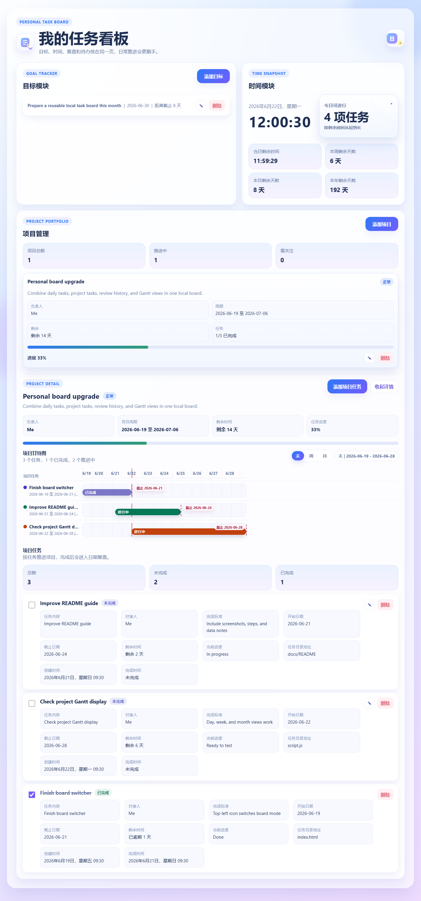
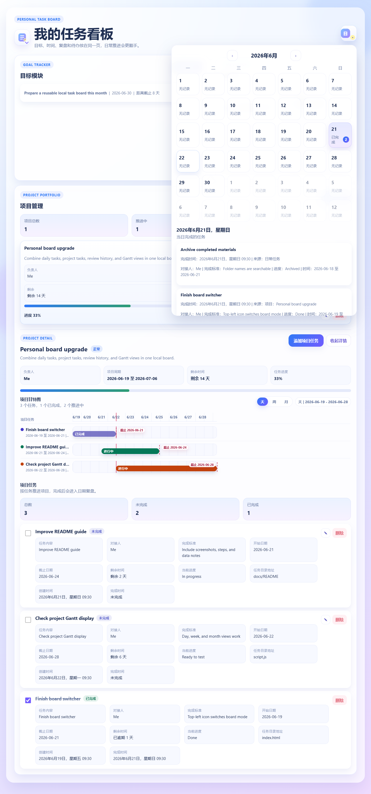

# 本地任务与项目管理看板

这是一个纯前端本地任务管理工具，包含日常任务、项目管理、目标、时间提醒、日期复盘和甘特图能力。

## 截图预览

> 截图中的任务和项目是演示数据，只用于说明界面效果；代码仓库不包含任何个人任务数据。

### 日常任务看板



### 今日可进行任务浮窗



### 项目管理看板



### 日期复盘查询



## 使用方式

直接打开 `index.html` 即可使用，不需要安装依赖或启动服务。

## 操作方法

### 切换日常任务和项目管理

1. 点击左上角的看板图标。
2. 在弹出的菜单中选择“日常任务”或“项目管理”。
3. 页面会只显示当前选择的工作区。

### 管理日常任务

1. 进入“日常任务”工作区。
2. 点击“添加任务”。
3. 填写任务内容、对接人、完成标准、开始日期、截止日期、当前进度和任务目录地址。
4. 点击任务左侧复选框可标记完成。
5. 点击任务右侧编辑按钮可修改任务。
6. 点击“清空已完成”可批量删除已完成的日常任务。

### 查看日常甘特图

1. 在“日常任务”工作区查看“日常任务甘特图”。
2. 使用右上角“天 / 周 / 月”切换不同时间粒度。
3. 红色竖线表示今天，任务条显示任务周期和截止日期。

### 使用今日可进行任务提醒

1. 在“时间模块”右侧查看“今日可进行”任务数量。
2. 点击该卡片会打开悬浮任务列表。
3. 列表会按剩余时间从短到长排序，逾期和今天截止的任务会排在更前面。
4. 点击任务名称会自动切换到对应工作区，并滚动高亮该任务详情。

### 管理项目

1. 切换到“项目管理”工作区。
2. 点击“添加项目”创建项目卡片。
3. 点击项目卡片进入项目详情。
4. 在项目详情中点击“添加项目任务”，录入任务内容、负责人、开始日期、截止日期等信息。
5. 项目卡片会自动统计任务总数、完成数、进度和风险状态。

### 查看项目甘特图

1. 点击某个项目卡片进入项目详情。
2. 在“项目甘特图”中查看该项目下所有项目任务的排期。
3. 使用“天 / 周 / 月”切换时间粒度。

### 日期复盘查询

1. 点击右上角日期小方块。
2. 在弹出的月历中选择日期。
3. 下方会显示该日期完成的日常任务和项目任务。

## 数据说明

- 任务、项目、目标和完成记录保存在浏览器 `localStorage` 中。
- 本上传版本只包含代码文件，不包含任何已有任务数据。
- 如果浏览器曾经打开过旧版本并保留了本地数据，可以在浏览器控制台执行：

```js
localStorage.clear();
location.reload();
```

执行后会清空当前浏览器域名下保存的本地任务数据。

## 文件说明

- `index.html`：页面结构
- `style.css`：界面样式
- `script.js`：任务、项目、日历、甘特图和本地存储逻辑
- `docs/screenshots/`：README 使用的界面截图

## 功能概览

- 点击左上角图标可切换“日常任务”和“项目管理”。
- 日常任务支持添加、编辑、完成、删除和日常甘特图。
- 项目管理支持项目卡片、项目任务、项目详情和项目甘特图。
- 时间模块会提示今天可进行的任务，并按剩余时间从短到长排序。
- 右上角日期按钮可查看每天完成的任务记录。

## 注意事项

- 这是本地单页面应用，没有后端账号系统。
- 更换浏览器、清理浏览器数据或换设备后，本地保存的数据不会自动同步。
- 如果要备份任务数据，需要额外导出浏览器 `localStorage`，当前版本暂未内置导入/导出功能。
